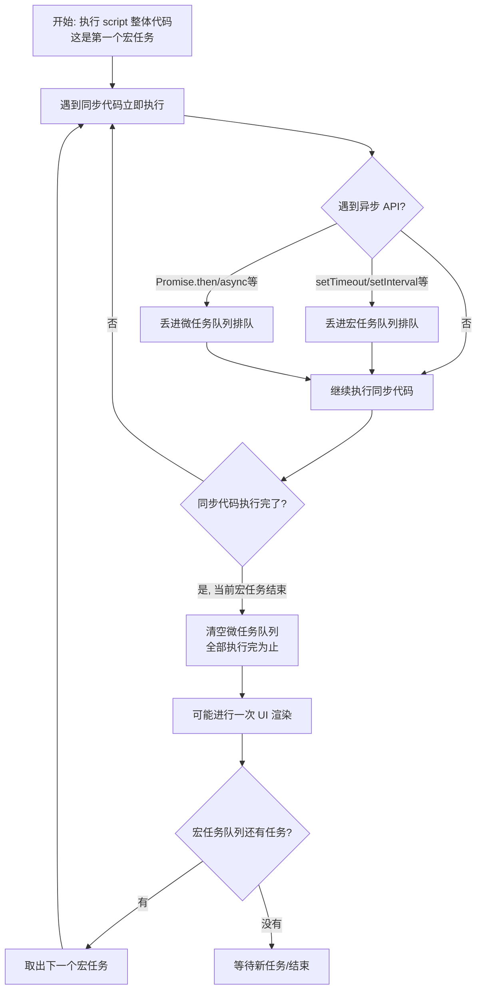

> 目标：读完这篇文档，你能自己推导出​**任意一段异步代码的执行顺序**，并能在面试/工作中讲清楚"为什么"。

---

## 1. 先搞懂大前提：JS 是单线程的

JavaScript 只有​**一个主线程**​，同一时间只能做一件事。但浏览器/Node 会提供很多"异步能力"（定时器、网络请求、文件 I/O、Promise 等），这些耗时操作不会阻塞主线程，而是​**先扔到后台处理，处理完了再把"回调函数"排队等着主线程来执行**。

这个"排队 + 依次执行"的机制，就是​**事件循环（Event Loop）**  ​。而排队用的"队列"，就分成了**宏任务队列**和**微任务队列**两种。

---

## 2. 事件循环（Event Loop）是什么

事件循环可以简化理解成一个死循环，伪代码如下：

```
while (true) {
  // 1. 执行一个宏任务（如果有的话）
  执行一个宏任务;

  // 2. 执行完这个宏任务后，立刻清空整个微任务队列
  while (微任务队列不为空) {
    取出并执行一个微任务;
  }

  // 3. （浏览器环境）视情况进行一次 UI 渲染
  可能触发一次页面重新渲染;

  // 4. 回到第 1 步，取下一个宏任务
}
```

**记住这句话就掌握了 80% 的知识点：**

> 每执行完 **一个** 宏任务，就要把当前微任务队列​**清空**（一个不留），然后才能开始下一个宏任务。

---

## 3. 什么是宏任务（Macrotask）

宏任务（Macrotask，也叫 Task）是"大颗粒度"的异步任务，​**每次事件循环只处理一个**。

### 常见的宏任务来源

|来源|说明|
| -------------------------------------| -----------------------------------------------------------------|
|`script` 整体代码|你的整段 `<script>` 代码本身就是第一个宏任务|
|`setTimeout`​ / `setInterval`|定时器回调|
|`setImmediate`（仅 Node.js）|Node 特有，下一轮循环立即执行|
|I/O 操作|文件读写、网络请求的回调（Node.js）|
|UI 渲染 / `requestAnimationFrame`|浏览器重新绘制页面（严格说 rAF 有点特殊，但通常按宏任务节奏处理）|
|`postMessage`|跨窗口/worker 通信|
|`MessageChannel`|消息通道|
|I/O 事件回调（点击、滚动等 DOM 事件）|用户交互触发的事件回调|

**关键特点：一次事件循环只从宏任务队列里取出并执行【一个】任务。**

---

## 4. 什么是微任务（Microtask）

微任务（Microtask，也叫 Jobs）是"优先级更高、粒度更细"的异步任务，​**每次宏任务执行完后，要一次性把队列中所有微任务全部执行完**，哪怕执行过程中又产生了新的微任务，也要接着执行，直到队列清空。

### 常见的微任务来源

|来源|说明|
| --------------| -----------------------------------------|
|`Promise.prototype.then / catch / finally`|最常见的微任务来源|
|`async/await`|`await`​ 之后的代码本质上是 `.then()` 的语法糖，是微任务|
|`queueMicrotask()`|显式创建一个微任务|
|`MutationObserver`|监听 DOM 变化的回调（浏览器）|
|`process.nextTick()`（仅 Node.js）|Node 特有，​**优先级比普通微任务还要高**（见第 8 节）|

**关键特点：微任务队列会被"清空式"执行，且优先级永远高于下一个宏任务。**

---

## 5. 核心执行规则（背下这一条就够了）

```
同步代码 
  > 当前宏任务里产生的微任务（全部清空）
    > 下一个宏任务
      > 该宏任务产生的微任务（全部清空）
        > 再下一个宏任务
          > ...（循环往复）
```

用一句话总结：

>  **"同步代码先跑完，跑完先看微任务箱子有没有东西，有就全倒出来执行完，箱子空了才能去取下一个宏任务。"**

---

## 6. 图解流程

我用一张流程图把上面的规则可视化一下：



如果你的阅读器不支持 Mermaid 渲染，可以直接看下面这张 "文字版" 时间轴：

```
主线程执行顺序（从左到右）：

[同步代码] → [微任务清空] → [渲染?] → [宏任务1] → [微任务清空] → [渲染?] → [宏任务2] → ...
   ↑                ↑
   |                └─ 这里如果又产生了新微任务，继续执行，直到队列真的空了
   └─ script 本身也是一种宏任务
```

---

## 7. 逐行代码实战：从简单到烧脑

### 例题 1：最基础的对比

```javascript
console.log('1'); // 同步

setTimeout(() => {
  console.log('2'); // 宏任务
}, 0);

Promise.resolve().then(() => {
  console.log('3'); // 微任务
});

console.log('4'); // 同步
```

**输出：**​****​****​**​**​**​`1 4 3 2`​**​**​**

逐步分析：

1. 同步代码优先执行：打印 `1`
2. 遇到 `setTimeout`，回调进宏任务队列（排队中，还没轮到）
3. 遇到 `Promise.then`，回调进微任务队列（排队中，还没轮到）
4. 继续执行同步代码：打印 `4`
5. 主线程同步代码跑完了，当前宏任务（script）结束
6. **清空微任务队列**​：打印 `3`
7. 微任务队列空了，可以取下一个宏任务了：执行 `setTimeout`​ 回调，打印 `2`

---

### 例题 2：微任务里嵌套微任务

```javascript
console.log('start');

setTimeout(() => {
  console.log('timeout');
}, 0);

Promise.resolve().then(() => {
  console.log('promise1');
  Promise.resolve().then(() => {
    console.log('promise2'); // 微任务中产生的新微任务
  });
});

console.log('end');
```

**输出：**​****​****​**​**​**​`start end promise1 promise2 timeout`​**​**​**

关键点：`promise1`​ 执行时又产生了一个新的微任务 `promise2`，因为规则是\*\*"清空整个微任务队列"\*\*，所以哪怕执行过程中又冒出新的微任务，也要继续执行完，直到队列真的空了，才轮到 `timeout`（下一个宏任务）。

---

### 例题 3：async/await 的本质

```javascript
async function asyncFn() {
  console.log('A'); // 同步执行
  await null;
  console.log('B'); // await 之后的代码 = .then() 里的代码 = 微任务
}

console.log('C');
asyncFn();
console.log('D');
```

**输出：**​****​****​**​**​**​`C A D B`​**​**​**

理解方式：把 `await null; console.log('B')` 等价改写成：

```javascript
Promise.resolve(null).then(() => {
  console.log('B');
});
```

也就是说，`async`​ 函数在 `await`​ **之前**的代码是**同步**执行的；`await`​ **之后**的代码会被包装成一个 `.then()` 丢进微任务队列。

---

### 例题 4：面试高频"地狱级"综合题

```javascript
console.log('1');

setTimeout(() => {
  console.log('2');
  Promise.resolve().then(() => {
    console.log('3');
  });
}, 0);

new Promise((resolve) => {
  console.log('4'); // Promise 构造函数是同步执行的！
  resolve();
}).then(() => {
  console.log('5');
});

setTimeout(() => {
  console.log('6');
}, 0);

console.log('7');
```

**输出：**​****​****​**​**​**​`1 4 7 5 2 3 6`​**​**​**

逐步分析：

1. 打印 `1`（同步）
2. 遇到第一个 `setTimeout`，回调排入宏任务队列（记作宏任务A）
3. `new Promise(...)`​ 的 ​**executor 函数是同步执行的**​，立刻打印 `4`
4. `.then()` 的回调排入微任务队列
5. 遇到第二个 `setTimeout`，回调排入宏任务队列（记作宏任务B）
6. 打印 `7`（同步代码结束）
7. **清空微任务队列**​：打印 `5`
8. 微任务队列空了，取下一个宏任务：执行宏任务A → 打印 `2`，同时产生新微任务
9. 宏任务A执行完，​**清空微任务队列**​：打印 `3`
10. 取下一个宏任务：执行宏任务B → 打印 `6`

> ⚠️ 易错点：很多人以为 `new Promise((resolve) => {...})`​ 里的代码是"异步"的，其实​**不是**​！Promise 的构造函数（executor）是**同步立即执行**的，只有 `.then/.catch/.finally` 里的回调才是异步（微任务）。

---

## 8. 浏览器 vs Node.js 的差异

Node.js 的事件循环比浏览器更复杂一些，多了几个概念，重点记住以下两点即可：

### 8.1 `process.nextTick` 优先级最高

在 Node.js 中，微任务其实分两种优先级：

```
process.nextTick 队列  >  Promise 微任务队列
```

也就是说，`process.nextTick()`​ 的回调，会比 `Promise.then()`​ **更早**执行。

```javascript
// Node.js 环境
Promise.resolve().then(() => console.log('promise'));
process.nextTick(() => console.log('nextTick'));

// 输出：nextTick → promise
```

### 8.2 Node.js 的宏任务分了 6 个阶段（Phase）

Node 的事件循环不是简单的一个宏任务队列，而是分成 6 个阶段依次循环，每个阶段处理不同类型的回调：

```
┌───────────────────────┐
│   timers（定时器）        │  ← setTimeout / setInterval
├───────────────────────┤
│   pending callbacks     │  ← 上一轮循环延迟的 I/O 回调
├───────────────────────┤
│   idle, prepare         │  ← 内部使用
├───────────────────────┤
│   poll（轮询，核心阶段）    │  ← 获取新的 I/O 事件
├───────────────────────┤
│   check                 │  ← setImmediate
├───────────────────────┤
│   close callbacks        │  ← 例如 socket.on('close')
└───────────────────────┘
```

每个阶段结束后，同样会清空一次微任务队列，再进入下一阶段。这也是为什么 `setTimeout(fn, 0)`​ 和 `setImmediate(fn)` 谁先谁后有时不确定（取决于是否在 I/O 回调里调用）。

**浏览器环境不用关心这些阶段，只需要记住第 5 节的核心规则即可。**

---

## 9. 常见误区

|误区|正确认识|
| -------------------------------| ---------------------------------------------------------------------------------------------------|
|❌ "`setTimeout(fn, 0)` 会立刻执行"|✅ 至少要等当前同步代码 + 所有微任务执行完，才可能轮到它，实际上还会有浏览器最小延迟（通常 4ms 起）|
|❌ "`new Promise()` 里的代码是异步的"|✅ executor 函数是**同步**执行的，只有 `.then` 里的回调才是异步|
|❌ "async 函数整体都是异步的"|✅ `await`​ **之前**的代码同步执行，`await`​ **之后**才是微任务|
|❌ "微任务执行一个就切回宏任务"|✅ 微任务队列是"扫荡式"清空，一次执行到空|
|❌ "宏任务队列也会一次性清空"|✅ 宏任务每轮循环只取**一个**执行|
|❌ "`requestAnimationFrame` 是微任务"|✅ 它跟渲染时机绑定，通常在微任务之后、下一次重绘之前执行，不属于普通微任务|

---

## 10. 速查表

|对比项|宏任务 (Macrotask)|微任务 (Microtask)|
| ----------------| ----------------------| -----------------------------------|
|别名|Task|Job|
|典型 API|`setTimeout`​、`setInterval`​、`setImmediate`、I/O、UI 事件|`Promise.then/catch/finally`​、`async/await`​、`queueMicrotask`​、`MutationObserver`|
|每轮循环执行数量|只取 **1 个**|**全部清空**|
|执行时机|上一轮微任务清空后|当前宏任务/微任务刚产生后，尽快执行|
|优先级|低|高（永远先于下一个宏任务）|
|Node 特有加强版|`setImmediate`|`process.nextTick`（优先级最高）|

---

## 11. 自测题

不看答案，自己在纸上（或脑子里）推一遍输出顺序，然后再运行代码验证：

```javascript
console.log('A');

setTimeout(() => console.log('B'), 0);

Promise.resolve()
  .then(() => console.log('C'))
  .then(() => console.log('D'));

async function test() {
  console.log('E');
  await Promise.resolve();
  console.log('F');
}
test();

console.log('G');
```

\<details\> \<summary\>点击查看答案与解析\</summary\>**输出顺序：**​****​****​**​**​**​`A E G C F D B`​**​**​**

1. `A` — 同步
2. `test()`​ 被调用，内部同步执行到 `await`​，打印 `E`
3. `await`​ 之后的部分被挂起，等价于产生一个微任务（打印 `F`）
4. 继续往下走同步代码，打印 `G`
5. 同步代码结束，开始清空微任务队列，按**入队顺序**执行：

   - 微任务 1：`Promise.resolve().then(() => console.log('C'))`​ → 打印 `C`​，同时它的 `.then(() => console.log('D'))` 又产生新微任务，追加到队尾
   - 微任务 2：`test()`​ 里 await 之后的部分 → 打印 `F`
   - 微任务 3（刚追加的）：打印 `D`
6. 微任务队列清空完毕，取下一个宏任务：`setTimeout`​ 回调 → 打印 `B`

\</details\>---

## 写在最后

如果你能把 **第 5 节的核心规则** 和 **第 7 节的 4 个例题** 完全吃透、自己能推导，那么无论面试还是实际写代码，遇到任何异步顺序问题你都能秒懂。

**一句话记忆法：**

> "同步先跑，跑完先倒微任务箱子（倒空为止），箱子空了才能摸一个宏任务出来，摸完接着倒箱子……循环往复。"
